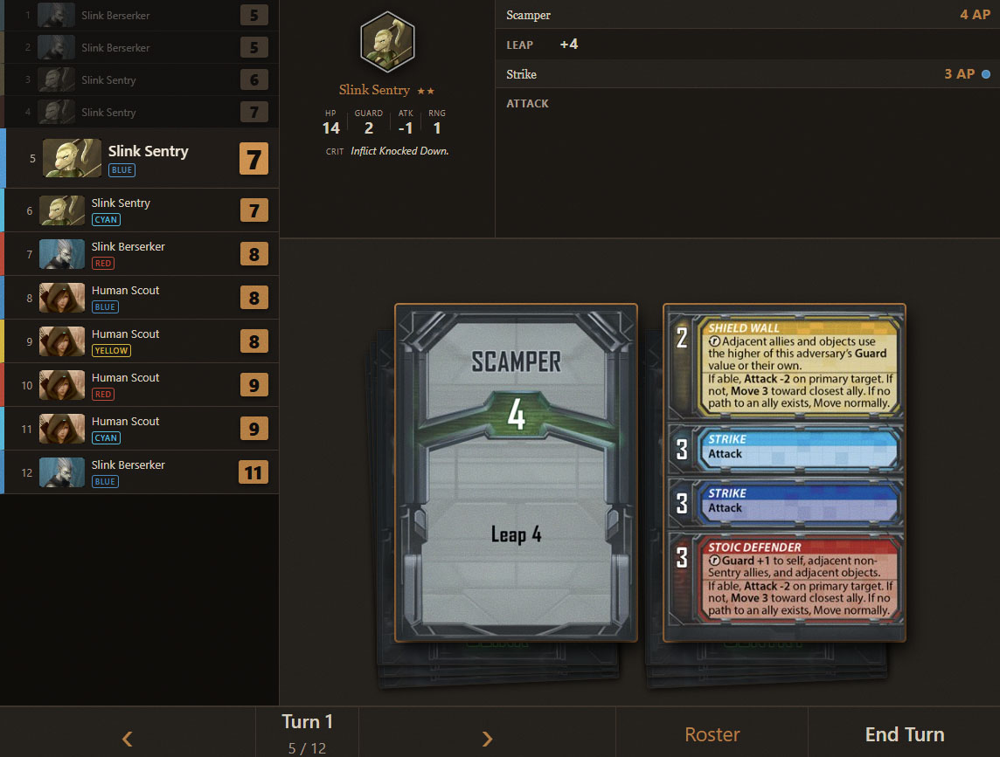

# Phantom Companion

A browser-based companion app for **Phantom Epoch** tabletop sessions.
Dark-themed, fullscreen SPA targeting laptop and tablet browsers.



---

## Phase 1 - Adversary Tracker (POC complete)

The first phase delivers a working adversary initiative and activation tracker
for use during play.

### What is built

**Adversary management**

- Add any of the 22 standard adversary types to a mission at any time
- Difficulty set per adversary group (1-4 stars) at add time
- All four color units (Red, Blue, Cyan, Yellow) tracked automatically per group
- Mark individual units dead or alive mid-mission via the roster overlay
- Remove entire adversary groups when they are defeated

**Turn engine**

- Draw a turn: one species card + one class card drawn per unique species/class
  combination, shared across all color units of that type
- Initiative calculated as species card AP + color class card AP
- Activation order sorted ascending (lowest initiative activates first)
- Turn counter and End Turn control; decks reshuffle automatically when exhausted

**Activation list (left panel)**

- Pre-draw: shows adversary groups with color pip indicators and star difficulty
- Post-draw: flat sorted list of all living units with activation order numbers
- Per-color background tint and colored left border for instant color recognition
- Select any unit to load its detail in the right panel

**Adversary detail panel (right panel)**

- Portrait, name, and star difficulty rating in a compact header
- Stats inline in the header: HP / Guard / Attack / Range, with Crit effect below
- Pre-draw: species and class card deck stack visuals
- Post-draw: drawn card art displayed at readable size for both species and class
- Aggregated action list below the cards: species card actions first,
  then the selected unit's own-color class card actions

**Data and assets**

- 22 adversary types across 6 classes and 8 species (bosses excluded from Phase 1)
- All game data served as static JSON from `/game-data/`
- Source art is resized and converted to apropriate graphics formats
- Target art size corresponds to displayed sizes

---

## Stack

- Astro 4 + Svelte 4 + TypeScript
- No backend; all state in Svelte stores, data loaded client-side

## Development

```
npm install
npm run dev
```

Open `http://localhost:4321` in a browser.

## Project layout

```
src/
  components/game/   Svelte UI components
  lib/               Game logic (deck, initiative, adversary data, asset URLs)
  stores/            gameStore (writable Svelte store + action functions)
  types/             TypeScript domain types
  styles/            Global CSS and design tokens
data/                Source game data and art (not served directly)
public/game-data/    Converted and optimised assets served to the browser
docs/planning/       Phase 1 implementation plan and task breakdown
```
